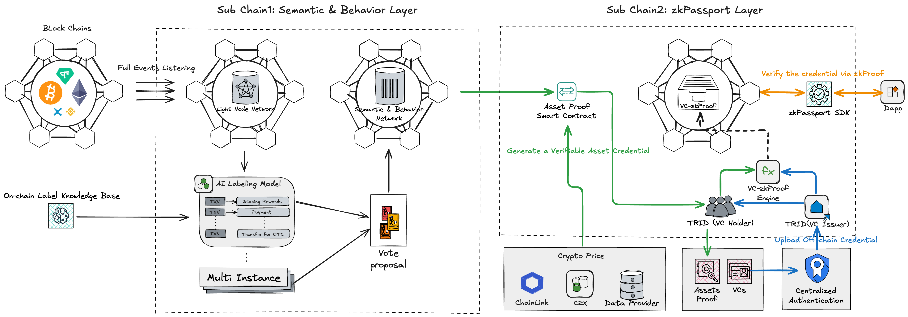

# Core Protocol Design

Mercury is a native Layer 1 blockchain composed of three interdependent sub-chains: the Semantic & Behavior Layer, True Value Layer, and zkPassport Layer.

## Semantic & Behavior Layer

A Layer 1 blockchain that supports on-chain transaction behavior analysis and address labeling. It combines a lightweight node listening network and an AI tagging network to give on-chain activities a “semantic layer” and “behavioral context.”

## zkPassport Layer

A Layer 1 blockchain that supports native identity authentication and privacy protection. Addresses can issue Verifiable Credentials (VC), as well as hold and verify VCs issued by others. All credentials are verified through Zero-Knowledge Proofs (zkProof), ensuring authenticity and compliance without disclosing the original data. zkPassport integrates zkProof on-chain with smart contracts, enabling automated, privacy-friendly identity and credential verification. It supports on-chain verification of KYC, tax certificates, and other real-world VCs, building a Web3 identity infrastructure for compliance, security, and programmable trust. Within this system, each address functions as a "passport" in the Web3 world, with capabilities for identification, authorization, and trust transmission. It serves as the core identity credential for users to access various on-chain services and ecosystems. Additionally, it can rely on the trusted asset analysis results provided by the True Value Layer to automatically issue verifiable asset proof VCs, further enriching identity profiles and credit dimensions.

<figure><figcaption>
Two Sub Layer Architecture Overview
</figcaption></figure>

The architecture constructs a full-chain analysis path of “behavior analysis → asset evaluation → identity verification.” The Semantic & Behavior Layer provides interpretable transaction behaviors and address profiles, while the True Value Layer outputs verifiable on-chain asset values. These data are used not only for smart contract decisions and user ratings but also as credible evidence for on-chain compliance, audits, and regulation. Through zkPassport, it automatically evaluates the real value of a user’s on-chain assets and supports the integration of real-world identities and VCs (such as KYC, tax certificates, etc.), constructing a trusted global credit system.

Mercury integrates identity, assets, and behaviors into a programmable, analyzable, and verifiable on-chain protocol structure. The three sub-chains communicate with each other through a native cross-chain communication protocol that enables data sharing and state interoperability. This communication protocol features:

* **Consensus-based Communication**: No external bridges or relays are required, as sub-chains verify native messages via consensus.
* **Data Structure Consistency:** Supports the cross-chain transmission of various structured data types, such as tag information, asset valuations, and VC credentials.
* **Contract Interoperability:** Contracts on one sub-chain can directly call contract methods on other sub-chains, enabling complex inter-chain logic.
